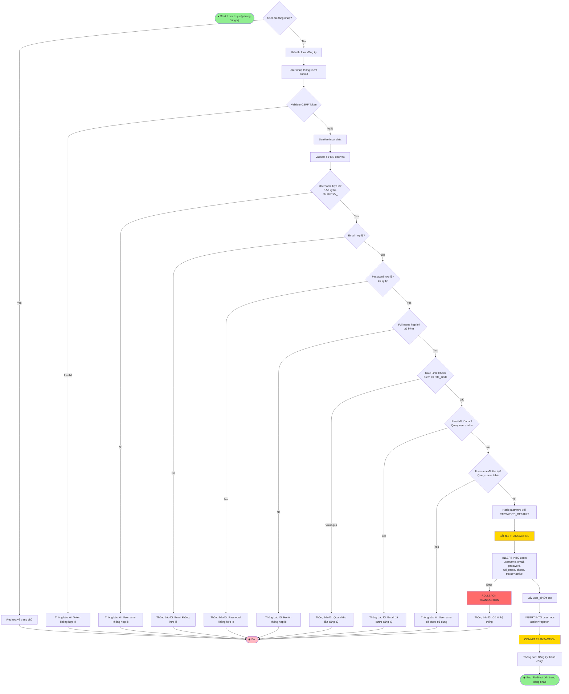
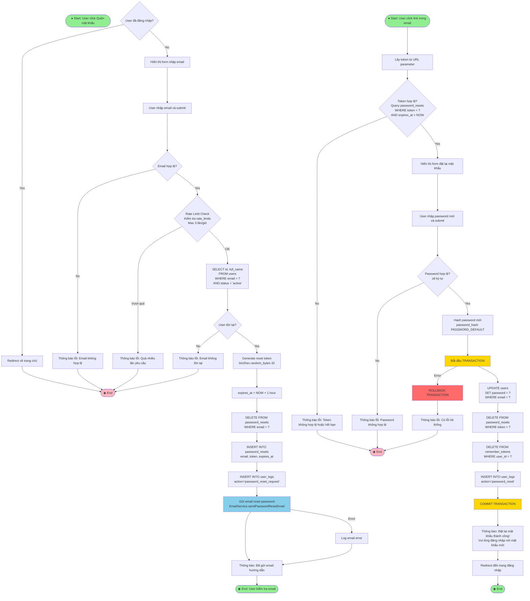

# Activity Diagram - Luồng Đăng Ký & Đăng Nhập

## 📋 Tổng Quan

Tài liệu này mô tả chi tiết Activity Diagram cho các luồng:
1. **Đăng Ký Tài Khoản**
2. **Đăng Nhập**
3. **Quên Mật Khẩu & Đặt Lại Mật Khẩu**
4. **Remember Me (Đăng Nhập Tự Động)**

## 🗄️ Các Bảng Dữ Liệu Liên Quan

- `users` - Thông tin người dùng
- `user_logs` - Log hoạt động người dùng
- `remember_tokens` - Token đăng nhập lâu dài
- `password_resets` - Token đặt lại mật khẩu
- `rate_limits` - Giới hạn tần suất thao tác

---

## 1️⃣ Activity Diagram: Đăng Ký Tài Khoản

### Mermaid Diagram



### Mô Tả Chi Tiết Các Bước

#### **Bước 1: Kiểm Tra Session**
- Nếu user đã đăng nhập → Redirect về trang chủ
- Nếu chưa đăng nhập → Hiển thị form đăng ký

#### **Bước 2: Validation CSRF Token**
- Kiểm tra CSRF token để chống CSRF attack
- Nếu không hợp lệ → Thông báo lỗi

#### **Bước 3: Sanitize & Validate Input**
- Sanitize: Loại bỏ HTML tags, escape special characters
- Validate:
  - Username: 3-50 ký tự, chỉ chữ cái, số, dấu gạch dưới
  - Email: Format email hợp lệ
  - Password: Tối thiểu 6 ký tự
  - Full name: Tối thiểu 2 ký tự

#### **Bước 4: Rate Limiting**
- Kiểm tra bảng `rate_limits` để chống spam
- Nếu vượt quá giới hạn → Thông báo lỗi

#### **Bước 5: Kiểm Tra Trùng Lặp**
- Kiểm tra email đã tồn tại trong `users` (UNIQUE constraint)
- Kiểm tra username đã tồn tại trong `users` (UNIQUE constraint)

#### **Bước 6: Tạo Tài Khoản**
- Hash password với `password_hash($password, PASSWORD_DEFAULT)`
- Bắt đầu TRANSACTION
- INSERT vào `users` với:
  - `username`, `email`, `password` (hashed)
  - `full_name`, `phone` (optional)
  - `status` = 'active'
  - `created_at` = NOW()
- Lấy `user_id` vừa tạo
- INSERT vào `user_logs` với `action='register'`
- COMMIT TRANSACTION

#### **Bước 7: Kết Quả**
- Thành công → Thông báo và redirect đến trang đăng nhập
- Lỗi → Rollback và thông báo lỗi

---

## 2️⃣ Activity Diagram: Đăng Nhập

### Mermaid Diagram

```mermaid
flowchart TD
    Start([● Start: User truy cập trang đăng nhập])
    
    CheckSession{User đã đăng nhập?}
    CheckSession -->|Yes| RedirectHome[Redirect về trang chủ]
    RedirectHome --> End1([◉ End])
    CheckSession -->|No| ShowForm[Hiển thị form đăng nhập]
    
    ShowForm --> UserSubmit[User nhập email và password]
    UserSubmit --> ValidateInput{Input hợp lệ?<br/>Email và password không rỗng}
    
    ValidateInput -->|No| ErrorInput[Thông báo lỗi: Vui lòng nhập đầy đủ]
    ErrorInput --> End1
    
    ValidateInput -->|Yes| QueryUser[SELECT * FROM users<br/>WHERE email = ?]
    
    QueryUser --> UserExists{User tồn tại?}
    UserExists -->|No| LogFailed1[INSERT INTO user_logs<br/>action='login_failed']
    LogFailed1 --> ErrorAuth[Thông báo lỗi: Email hoặc mật khẩu không đúng]
    ErrorAuth --> End1
    
    UserExists -->|Yes| CheckStatus{User status = 'active'?}
    CheckStatus -->|No| ErrorInactive[Thông báo lỗi: Tài khoản đã bị vô hiệu hóa]
    ErrorInactive --> End1
    
    CheckStatus -->|Yes| VerifyPassword{password_verify<br/>password với hash?}
    VerifyPassword -->|No| LogFailed2[INSERT INTO user_logs<br/>action='login_failed']
    LogFailed2 --> ErrorAuth
    
    VerifyPassword -->|Yes| StartSession[Tạo Session:<br/>$_SESSION['user_id']<br/>$_SESSION['user_email']<br/>$_SESSION['user_name']<br/>$_SESSION['username']<br/>$_SESSION['user_role']<br/>$_SESSION['login_time']]
    
    StartSession --> UpdateLastLogin[UPDATE users<br/>SET last_login = NOW()<br/>WHERE id = ?]
    
    UpdateLastLogin --> CheckRememberMe{Remember Me<br/>được chọn?}
    
    CheckRememberMe -->|Yes| GenerateToken[Generate remember token<br/>bin2hex random_bytes 32]
    GenerateToken --> HashToken[Hash token với SHA256]
    HashToken --> DeleteOldToken[DELETE FROM remember_tokens<br/>WHERE user_id = ?]
    DeleteOldToken --> InsertToken[INSERT INTO remember_tokens<br/>user_id, token, expires_at<br/>expires_at = NOW + 30 days]
    InsertToken --> SetCookie[Set cookie 'remember_token'<br/>expires = 30 days]
    SetCookie --> LogSuccess1[INSERT INTO user_logs<br/>action='login']
    LogSuccess1 --> Success1[Thông báo: Đăng nhập thành công!]
    
    CheckRememberMe -->|No| LogSuccess2[INSERT INTO user_logs<br/>action='login']
    LogSuccess2 --> Success1
    
    Success1 --> CheckRedirect{Có redirect URL?<br/>$_SESSION['login_redirect_url']}
    CheckRedirect -->|Yes| RedirectToURL[Redirect đến URL đã lưu]
    CheckRedirect -->|No| RedirectHome2[Redirect về trang chủ]
    
    RedirectToURL --> End2([◉ End])
    RedirectHome2 --> End2
    
    style Start fill:#90EE90
    style End1 fill:#FFB6C1
    style End2 fill:#90EE90
    style StartSession fill:#87CEEB
    style VerifyPassword fill:#FFD700
```

### Mô Tả Chi Tiết Các Bước

#### **Bước 1: Kiểm Tra Session**
- Nếu user đã đăng nhập → Redirect về trang chủ
- Nếu chưa đăng nhập → Hiển thị form đăng nhập

#### **Bước 2: Validate Input**
- Kiểm tra email và password không rỗng

#### **Bước 3: Query User**
- SELECT từ `users` WHERE `email` = ?
- Nếu không tìm thấy → Log `login_failed` và thông báo lỗi

#### **Bước 4: Kiểm Tra Status**
- Kiểm tra `users.status` = 'active'
- Nếu không active → Thông báo lỗi

#### **Bước 5: Verify Password**
- Sử dụng `password_verify($password, $user['password'])`
- Nếu không khớp → Log `login_failed` và thông báo lỗi

#### **Bước 6: Tạo Session**
- Tạo session với các thông tin:
  - `user_id`, `user_email`, `user_name`
  - `username`, `user_role`, `login_time`

#### **Bước 7: Cập Nhật Last Login**
- UPDATE `users.last_login` = NOW()

#### **Bước 8: Xử Lý Remember Me (Optional)**
- Nếu user chọn "Remember Me":
  - Generate token: `bin2hex(random_bytes(32))`
  - Hash token với SHA256
  - Xóa token cũ của user (nếu có)
  - INSERT vào `remember_tokens` với expires_at = NOW + 30 days
  - Set cookie `remember_token` với expires = 30 days

#### **Bước 9: Log Activity**
- INSERT vào `user_logs` với `action='login'`

#### **Bước 10: Redirect**
- Kiểm tra `$_SESSION['login_redirect_url']`
- Nếu có → Redirect đến URL đó
- Nếu không → Redirect về trang chủ

---

## 3️⃣ Activity Diagram: Quên Mật Khẩu & Đặt Lại Mật Khẩu

### Mermaid Diagram



### Mô Tả Chi Tiết Các Bước

#### **Phần 1: Yêu Cầu Reset Mật Khẩu**

1. **Kiểm Tra Session**: Nếu đã đăng nhập → Redirect
2. **Validate Email**: Kiểm tra format email hợp lệ
3. **Rate Limiting**: Kiểm tra `rate_limits` (max 3 lần/giờ)
4. **Query User**: SELECT từ `users` WHERE `email` = ? AND `status` = 'active'
5. **Generate Token**: `bin2hex(random_bytes(32))`
6. **Set Expires**: `expires_at` = NOW + 1 hour
7. **Delete Old Token**: Xóa token cũ của email này (nếu có)
8. **Insert Token**: INSERT vào `password_resets`
9. **Log Activity**: INSERT vào `user_logs` với `action='password_reset_request'`
10. **Send Email**: Gửi email chứa link reset password
11. **Thông Báo**: Thông báo đã gửi email

#### **Phần 2: Đặt Lại Mật Khẩu với Token**

1. **Get Token**: Lấy token từ URL parameter
2. **Validate Token**: 
   - Query `password_resets` WHERE `token` = ? AND `expires_at` > NOW
   - Nếu không hợp lệ → Thông báo lỗi
3. **Show Form**: Hiển thị form đặt lại mật khẩu
4. **Validate Password**: Kiểm tra password ≥ 6 ký tự
5. **Hash Password**: Hash password mới
6. **Begin Transaction**: Bắt đầu TRANSACTION
7. **Update Password**: UPDATE `users.password`
8. **Delete Token**: Xóa token đã sử dụng từ `password_resets`
9. **Delete Remember Tokens**: Xóa tất cả `remember_tokens` của user (bắt buộc đăng nhập lại)
10. **Log Activity**: INSERT vào `user_logs` với `action='password_reset'`
11. **Commit Transaction**: COMMIT TRANSACTION
12. **Thông Báo & Redirect**: Thông báo thành công và redirect đến trang đăng nhập

---

## 4️⃣ Activity Diagram: Remember Me (Auto Login)

### Mermaid Diagram

```mermaid
flowchart TD
    Start([● Start: User truy cập website<br/>không có session])
    
    CheckSession{Session tồn tại?<br/>$_SESSION['user_id']}
    CheckSession -->|Yes| UserLoggedIn[User đã đăng nhập]
    UserLoggedIn --> End1([◉ End])
    
    CheckSession -->|No| CheckCookie{Cookie 'remember_token'<br/>tồn tại?}
    CheckCookie -->|No| UserNotLoggedIn[User chưa đăng nhập]
    UserNotLoggedIn --> End1
    
    CheckCookie -->|Yes| HashToken[Hash token với SHA256]
    HashToken --> QueryToken[SELECT rt.user_id, u.id, u.email,<br/>u.full_name, u.username, u.status<br/>FROM remember_tokens rt<br/>JOIN users u ON rt.user_id = u.id<br/>WHERE rt.token = ?<br/>AND rt.expires_at > NOW()<br/>AND u.status = 'active']
    
    QueryToken --> TokenValid{Token hợp lệ?}
    
    TokenValid -->|No| DeleteCookie[Delete cookie 'remember_token']
    DeleteCookie --> UserNotLoggedIn
    
    TokenValid -->|Yes| StartSession[Tạo Session:<br/>$_SESSION['user_id']<br/>$_SESSION['user_email']<br/>$_SESSION['user_name']<br/>$_SESSION['username']<br/>$_SESSION['user_role']<br/>$_SESSION['login_time']]
    
    StartSession --> UpdateLastLogin[UPDATE users<br/>SET last_login = NOW()<br/>WHERE id = ?]
    
    UpdateLastLogin --> LogAutoLogin[INSERT INTO user_logs<br/>action='auto_login']
    
    LogAutoLogin --> UserLoggedIn
    
    style Start fill:#90EE90
    style End1 fill:#90EE90
    style StartSession fill:#87CEEB
    style TokenValid fill:#FFD700
```

### Mô Tả Chi Tiết Các Bước

#### **Bước 1: Kiểm Tra Session**
- Nếu có session → User đã đăng nhập → End

#### **Bước 2: Kiểm Tra Cookie**
- Nếu không có cookie `remember_token` → User chưa đăng nhập → End
- Nếu có cookie → Tiếp tục

#### **Bước 3: Validate Token**
- Hash token với SHA256
- Query `remember_tokens` JOIN `users`:
  - `rt.token` = hashed_token
  - `rt.expires_at` > NOW()
  - `u.status` = 'active'

#### **Bước 4: Xử Lý Kết Quả**
- **Token không hợp lệ**:
  - Delete cookie `remember_token`
  - User chưa đăng nhập → End
  
- **Token hợp lệ**:
  - Tạo session với thông tin user
  - UPDATE `users.last_login` = NOW()
  - INSERT vào `user_logs` với `action='auto_login'`
  - User đã đăng nhập → End

---

## 📊 Tổng Hợp Các Bảng Được Sử Dụng

### **users**
- **Thao tác**: INSERT, UPDATE, SELECT
- **Các trường quan trọng**:
  - `id` (PK)
  - `username` (UNIQUE)
  - `email` (UNIQUE)
  - `password` (hashed)
  - `status` (enum: 'active', 'inactive')
  - `last_login` (datetime)

### **user_logs**
- **Thao tác**: INSERT
- **Các action được log**:
  - `register`
  - `login`
  - `login_failed`
  - `auto_login`
  - `password_reset_request`
  - `password_reset`

### **remember_tokens**
- **Thao tác**: INSERT, DELETE, SELECT
- **Các trường quan trọng**:
  - `user_id` (FK, UNIQUE)
  - `token` (hashed SHA256)
  - `expires_at` (datetime)

### **password_resets**
- **Thao tác**: INSERT, DELETE, SELECT
- **Các trường quan trọng**:
  - `email`
  - `token`
  - `expires_at` (datetime, 1 hour)

### **rate_limits**
- **Thao tác**: INSERT, SELECT
- **Mục đích**: Chống spam, giới hạn tần suất thao tác

---

## ⚠️ Các Điểm Cần Lưu Ý

### 1. **Security**
- ✅ CSRF Token validation
- ✅ Password hashing với `PASSWORD_DEFAULT`
- ✅ Rate limiting chống spam
- ✅ Token expiration (1 hour cho password reset, 30 days cho remember me)
- ✅ Input sanitization và validation
- ✅ SQL injection prevention (Prepared statements)

### 2. **Data Integrity**
- ✅ Transaction cho các thao tác quan trọng (đăng ký, reset password)
- ✅ UNIQUE constraints (username, email)
- ✅ Foreign key constraints

### 3. **User Experience**
- ✅ Remember Me option (30 days)
- ✅ Redirect sau khi đăng nhập
- ✅ Clear error messages
- ✅ Auto-login với remember token

### 4. **Logging & Audit**
- ✅ Log tất cả hoạt động vào `user_logs`
- ✅ Log failed login attempts
- ✅ Log password reset requests

---

## 📝 Notes

1. **Email Verification**: Hiện tại hệ thống chưa có xác thực email, nhưng có trường `email_verified_at` trong database để chuẩn bị cho tính năng này.

2. **Account Lockout**: Hệ thống có trường `login_attempts` và `locked_until` trong bảng `users` nhưng chưa được implement trong code hiện tại.

3. **Password Strength**: Hiện tại chỉ yêu cầu tối thiểu 6 ký tự. Có thể nâng cấp thêm yêu cầu về độ phức tạp.

4. **Session Management**: Session được quản lý bởi PHP session, có thể cấu hình timeout trong `php.ini`.

---

**Tài liệu này được tạo dựa trên code thực tế trong dự án Web Mua Bán Đồ Cũ.**
